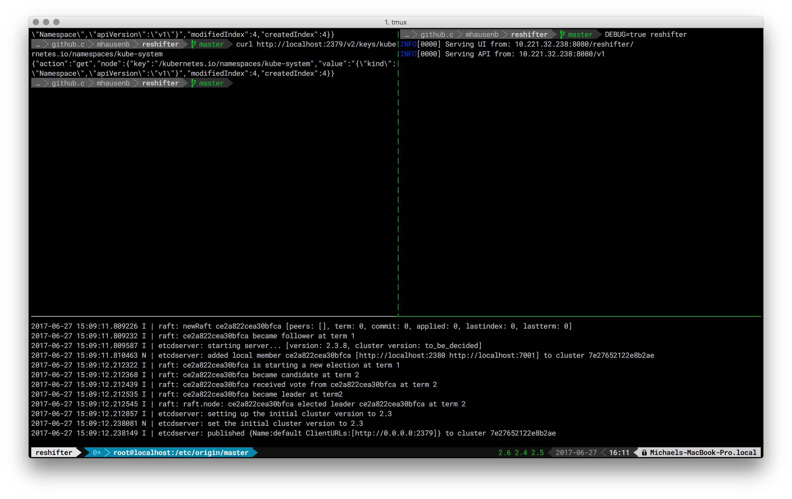

# ReShifter

[](https://goreportcard.com/report/github.com/mhausenblas/reshifter)
[](https://godoc.org/github.com/mhausenblas/reshifter)
[](https://quay.io/repository/mhausenblas/reshifter)

A cluster admin backup and restore tool for Kubernetes distros such as OpenShift, using etcd to query and manipulate the state of all objects.

[](https://www.useloom.com/share/e590aedeb95b441fb23ab4f9e9e80c32 "Introducing ReShifter")  


- [Status and roadmap](#status-and-roadmap)
- [Deploy app locally](#deploy-app-locally)
- [Deploy app in OpenShift](#deploy-app-in-openshift)
- [Deploy app in Kubernetes](#deploy-app-in-kubernetes)
- [CLI tool](#cli-tool)
- [Test and development](#test-and-development)

## Status and roadmap

See [Trello board](https://trello.com/b/iOrEdJQ3/reshifter).

## Deploy app locally

If you want to use the ReShifter app, that is the Web UI, you need to use the Docker image since it bundles the static assets such as HTML, CSS, and JS and the Go binary.
For example, to launch the ReShifter app locally, do:

```
$ docker run --rm -p 8080:8080 quay.io/mhausenblas/reshifter:0.3.3
```

If you want to use the ReShifter API, for example as a head-less service, you can simply use the binary, no other dependencies required:

```
$ curl -s -L https://github.com/mhausenblas/reshifter/releases/download/v0.3.1-alpha/reshifter -o reshifter
$ chmod +x reshifter
$ ./reshifter
```

The ReShifter HTTP API is defined in and available via Swagger: [swaggerhub.com/apis/mhausenblas/reshifter/1.0.0](https://swaggerhub.com/apis/mhausenblas/reshifter/1.0.0)

## Deploy app in OpenShift

Note: requires an OpenShift 1.5 cluster and [oc](https://github.com/openshift/origin/releases/tag/v1.5.1) installed, locally.

```
$ make init
$ make publish
```

## Deploy app in Kubernetes

TBD.

## CLI tool

ReShifter also provides for a CLI tool called `rcli`.
Get binary releases for Linux and macOS via the [GitHub release page](https://github.com/mhausenblas/reshifter/releases/tag/v0.3.1-alpha).

```
$ rcli -h
A CLI for ReShifter, supports backing up and restoring Kubernetes clusters.

Usage:
  rcli [command]

Available Commands:
  backup      Creates a backup of a Kubernetes cluster
  explore     Probes an etcd endpoint
  help        Help about any command
  restore     Performs a restore of a Kubernetes cluster
  version     Displays the ReShifter version
```

Here's a simple usage example which assumes that you've got a Kubernetes cluster with an etcd on `http://localhost:4001` running:

```
# explore the endpoint, overwrite default:
$ rcli explore -e http://localhost:4001

# back up to Minio playground:
$ ACCESS_KEY_ID=Q3AM3UQ867SPQQA43P2F \
  SECRET_ACCESS_KEY=zuf+tfteSlswRu7BJ86wekitnifILbZam1KYY3TG \
  rcli/rcli backup -e http://localhost:4001 -r play.minio.io:9000 -b mh9-test

# restart/empty etcd now

# restore from Minio playground, using backup ID 1498815551
$ ACCESS_KEY_ID=Q3AM3UQ867SPQQA43P2F \
  SECRET_ACCESS_KEY=zuf+tfteSlswRu7BJ86wekitnifILbZam1KYY3TG \
  rcli/rcli restore -e http://localhost:4001 -r play.minio.io:9000 -b mh9-test -i 1498815551
```

## Test and development

See the pages for [testbed](https://github.com/mhausenblas/reshifter/tree/master/testbed) and [development](https://github.com/mhausenblas/reshifter/blob/master/dev.md).
